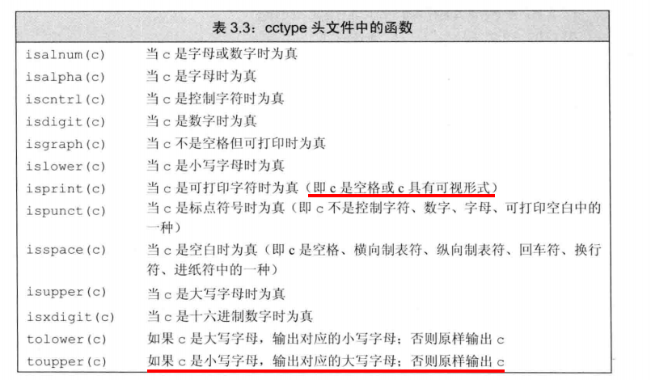
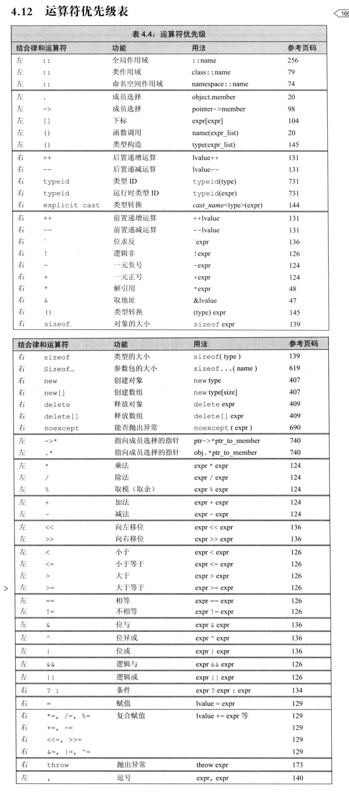

# c++ prime5

[TOC]


## 一、c++基础

* 变量和声明的关系

  1. c++允许变量的声明和定义分离，声明使得程序得知学个变量，一个文件想要别处声明的名字必须包含那个名字的声明。
  2. 而定义负责创建与名字相关联的实体。
  3. 任何包含显示初始化的声明即定义。

  ```c++
  extern int i; // 声明i而非定义i
  int j; // 声明并定义了j
  // 如果在extern后面的变量赋了初始值，那么就抵消了extern的作用，从声明变成了定义。
  extern double pi = 3.1415; // 定义
  ```

* 变量的赋值和初始化

  1. 变量的初始化是指创建变量并赋予一个初值，变量的赋值是指擦除原来的值并赋予新值。

* 变量的作用域

  1. 作用域允许彼此包含，作用域内中的作用域叫做内层作用域，包含着内存作用域的叫做外层作用域。
  2. 外层作用域声明的变量允许内层作用域使用，也允许内存作用域重新定义外层作用域已有的名字。

* 复合类型

  1. C++中有几种复合类型，其中包括引用和指针。

  2. 一条简单的语句由一个数据类型和紧随其后的变量名列表组成。

  3. 一条声明语句由一个**基本数据类型**和紧随气候的一个**声明符**列表组成。每个声明符命名了一个变量并指定该变量为与基本数据类型有关的某种类型。

  4. 目前为止，我们所接触的声明符就是变量名，此时变量类型也就是基本数据类型。其实还有更复杂的声明符，它基于基本数据类型得到更复杂的类型，并把它指定给变量。

  5. 引用（现在是左值引用）

     引用是为对象起了另一个名字，引用类型引用另外一种类型，通过将声明符写成&d的形式来定义引用类型，其中d是声明的变量名。

  ```c++
  int ival = 1024;
  int &refval = ival; // refval指向ival(是ival的另一个名字)
  int &refval2;  // 错误，引用必须被初始化
  ```

  6. 引用即别名，它是为已经存在的对象起另一个名字。
  7. 引用不能绑定到一个字面值或表达式上，而且类型必须相同

  ```c++
  int &refval4 = 10; // 错误
  double dval = 3.14;
  int &refval5 = dval; // 错误，类型必须相同。
  ```

  8. 指针

  ```c++
  int ival = 42;
  int *p = &ival; // 指针变量p存放了变量ival的地址，或者说p是指向变量ival的指针。
  //因为引用不是对象，没有实际地址，所以不能定义指向引用的指针。
  
  int i = 3;
  int *p = &i;
  int &r = *p;
  cout << r << endl; // 输出3
  r = 4;
  cout << *p << endl; // 输出4
  ```

* 空指针

  ```c++
  int *p1 = nullptr;
  int *p2 = 0;
  int *p3 = NULL;
  ```

* 需要记住：赋值永远改变的是等号左侧的对象

  ```c++
  pi = &ivar; // 现在pi指向了ivar
  ```

* void* 指针。

  void* 是一种特殊的指针类型，用于存放任意对象的地址。一个void*指针存放这一个地址。

  void* 可以做的事情比较有限：拿它和别的指针做比较，作为函数的输入或输出，或者赋给另外的一个void*指针。

* 理解复合类型的声明

* const限定符

  ```c++
  const int bufSize = 512;
  const 对象一旦创建就不能改变，所以一定要初始化
  const int j = get_size();
  const int j = 42;
  const int k; // 错误，k没有初始化。
  
  // 在默认情况下，const对象仅在文件内有效。
  const int bufSize = 512;
  // 编译器会在编译过程中把用到该变量的地方都替换成对应的值。也就是说，编译器会找到代码中所有用到bufSize的地方。然后用512替换。
  // 下面是因为c++语言支持分离式编译机制，该机制允许程序分割为若干个文件，每个文件可以独立编译。
  // 为了执行上述的替换，编译器就必须知道变量的初始值。如果程序包含多个文件，则用了const对象的文件都必须得能放问到它的初始值才行。要做到这一点，就必须在每一个用到该变量的文件都有对它的定义。
  // 为了支持上面的用法。同时避免对常量的重复定义，默认情况下，const对象被设定为仅对文件内有效。当多个文件中出现了同名的const变量时，其实等同于在不同文件中分别定义了独立的变量。
  // 如果几个文件要使用相同的常量，对于const变量不管是声明还是定义都添加extern关键字。这样只需依次定义就可以。
  // file1.cpp
  extern const int bufSize = fcn(); // 指明bufSize并非本文件所独有，他的定义将出现在别处。
  // file2.cpp
  extern const int bufSize;  // 与file1.cpp中定义的bufSize是同一个。
  
  ```

* const的引用

  ```c++
  //可以把引用绑定到const对象上，就系那个绑定到
  const int c1 = 1;
  const int &c2 = c1; // 正确，引用及其对应的对象都是常量
  int &c3 = c1 // 错误，试图把一个非常量引用指向一个常量对象，这样的话可以通过c3修改c1的值，这样不行。
  
  // 初始化和const引用
  // 一般认为引用不能指向一个值或者表达式，而常量引用可以允许任何表达式作为初始值，只要能够自动转化成相同类型就行。
  // 常量引用允许绑定一个非常量对象，字面值或者表达式
  int i = 42; // 非常量对象
  const int &r1 = i; // 正确；
  const int &r2 = 42; // 正确；
  const int &r3 = r1 * 2; // 正确；
  int &r4 = r1 * 2; // 错误
  
  /* 理解const引用 */
  double dVal = 3.14;
  const int &ri = dVal;
  // 上面的过程到底发生了什么呢？
  1. const int temp = dVal; // 生成一个临时对象
  2. const int &ri = temp;  // 引用指向这个临时对象。
  
  int ival = 1;
  int &r1 = ival;
  const int &r2 = ival;
  r1 = 0; // 正确
  r2 = 0; // 错误，r2是一个常量引用。
  ```

* const指针

  ```c++
  // 和引用一样，也可以让指针指向 常量 或者 非常量。指向常量的指针不能修改其内容。
  // 想要存放常量对象的地址，只能使用指向常量的指针。
  const double pi = 3.14;
  double *ptr = &pi; // 错误，ptr是一个普通指针。
  const double *cptr = &pi; // 正确，cptr可以指向一个双精度常量。这个叫指向常量的指针。
  *ptr = 42; // 错误，不能对常量指针修改。
  
  // 允许常量指针指向一个非常量对象
  double dval = 3.14;
  const double *pi = &dval; // 正确
  
  // 由于指针是对象，而引用不是，所以就像其他类型一样，指针允许定义为常量。
  // 常量指针必须初始化，一旦初始化完成，那么这个指针保存的地址就不能改变了
  // 把*放在const之前说明指针是一个常量，这样书写有另一层含义，即不变的是指针本身而非指向的那个值。
  int errNumb = 0;
  int *const curErr = &errNumb; // curErr 将一直指向errNumb;
  const double pi = 3.14;
  const double *const pip = &pi;  // pip是一个指向常量对象的常量指针。
  
  // 像弄明白上面的含义，最好就是从右往左读
  // curErr左边是const，说明curErr是一个常量对象，然后判断其类型，有*号，说明这是一个常量指针，最后，可以判读是一个指向的是一个int对象。
  // 同理，可以判断pip是一个指向双精度常量的常量指针。
  // 指针本身是一个常量并不影响使用指针来修改它指向的对象的值，例如curErr就可以修改errNumb的值，但是pip不能修改pi的值。
  ```

* 顶层const

  ```c++
  // 指针是一个对象，指针指向的内容又是一个对象。所以指针是否是常量和指向的对象是否是常量是两个相互独立的问题
  // 用顶层const来标识指针是一个常量，用底层const来表示指向的对象是一个常量。
  // 指针即可以在顶层const也可以在底层const
  // 顶层const来修饰本省，用底层const来修饰其指向的内容。
  int i = 0;
  int *const p1 = &i; // 不能改变p1的值，是一个顶层const
  const int ci = 42; // 不能修改ci的值，是一个顶层const
  const int *p2 = &ci; // 允许修改p2的值，是一个低层const。
  const int *const p3 = p2; // 右边的const是顶层const，左边的const是底层const
  const int &r = ci; // 用于声明引用的const都是底层const。
  
  // 在执行拷贝操作时，顶层const和底层const的区别在于顶层const不受什么影响。
  i = ci;
  p2 = p3; // 正确，p2和p3指向的内容相同，p3的顶层const部分不影响。
  ```

* constexpr和常量表达式

  ```c++
  // 常量表达式是指不会改变并且在编译过程中就能得到结果的计算表达式。
  // 显然，字面值属于常量表达式，用常量表达式初始化的const对象也是常量表达式。
  // 一个表达式是不是常量表达式由数据类型和初始值共同决定。
  const int max_files = 20; // 常量表达式
  const int limit = max_files+1; // 常量表达式。
  int staff_size = 77; // 不是常量表达式
  const int sz = get_size(); // 不是常量表达式。
  
  //constexpr 变量
  // 将变量声明为constexpr以便于编译器来检查变量的值是否是一个常量表达式。
  // 由constexpr声明的变量一定是一个常量，而且必须用常量表达式来初始化
  constexpr int mf = 20; // 正确
  constexpr int limit = mf + 1; // 正确
  constexpr int sz = size(); // 只有size()是一个constexpr函数时才是一个正确的语句。像这种表达式一般足够简单能够让编译器直接计算出结果。
  
  // 字面值类型
  // 一般比较简单，值也比较容易得到的叫做字面值类型。例如算数，引用和指针都属于字面值类型。自定义的类，string类型都不是字面值类型。
  // 尽管指针和引用都可以定义成constexpr, 不过他们的初始值会受到严格限制。
  // 一个constexpr的初始值必须是nullptr或0或者是存储于某个固定地址的对象。
  // 函数体内定义的变量一般并非放在固定地址中，因此constexpr指针不能指向这样的变量。相反的，定义于所有函数体之外的对象其地址固定不变，能用来初始化constexpr指针。允许函数定义一类有效范围超出函数本身的变量，这类变量也有固定的地址。因此，constexpr引用能绑定在这样的变量上。
  // 必须明确一点，在constexpr声明中如果定义了一个指针，限定符constexpr仅对指针有效，与指针所指向的对象无关。
  const int *p = nullptr; // p是一个指向整型常量的指针，它保存的地址可以改变。
  constexpr int *q = nullptr; // q是一个指向整数的常量指针。
  
  ```

* 类型别名

  ```c++
  // 有两种方法来定义类型别名，传统方法时typedef：
  typedef double wages; // wages是double的同义词
  typedef wages base, *p; // base是double的同义词，p是double*的同义词。
  // 在新的规定中，使用别名声明来定义类型的别名
  using SI = Sales_item; // SI是Sales_item的同义词。把SI规定成Sales_item的别名。
  wages hourly, weekly; // 等价于double hourly, weekly;
  
  // 指针、常量和类型别名
  // 如果类型别名指代的是复合类型或常量，那么把它用到声明语句里就会产生意想不到的后果。
  typedef char *pstring;
  const pstring cstr = 0; // cstr是指向char的常量指针。 这个是指向char的常量指针。
  const char *cstr = 0; // 和上面不等价。这个是指向const char的指针
  const pstring *ps; // ps是一个指针，他的对象时指向char的常量指针。
  ```

* auto类型说明符

  ```c++
  // auto 类型的变量可以让编译器头推算类型
  auto item = val1 + val2; // 这个时候item的类型由val1和val2来推算。如果val是Sale_item，那么item就是Sales_item。
  // 使用auto也能声明多个变量。因为一条声明语句只能由一种数据类型，所以该语句中所有变量的数据基本类型都是一样的。
  auto i = 0, *p = &i; // 正确，i是整数，p是整型指针。
  auto sz = 0, pi = 3.14; // 错误，sz和pi的类型不一致。
  
  // 有时候，编译器推算出来的类型和初始类型不一致，编译器会适当的改变结果类型使更符合初始化规则
  ```
  
* decltype类型指示符

  ```c++
  // 有时候希望从表达式的类型推断出要定义的变量的类型，但是不想用该表达式的值初始化变量。
  // 为了上面的需求，引入的第二种类型说明符decltype。它的作用是选择并返回操作数的数据类型。
  decltype(f()) sum = x; // sum的类型就是函数f的返回类型。
  // 编译器并不实际调用函数f，二是使用当调用发生时f的返回值类型作为sum的类型。
  decltype 处理顶层const和引用的方式与auto有些不同。如果 decltype 使用的表达式是一个变量，则 decltype 返回该变量的类型（包括顶层const和引用在内）
  const int ci = 0, &cj = ci;
  decltype(ci) x = 0; // x的类型是const int
  decltype(cj) y = x; // y的类型是const int &，y绑定到变量x
  decltype(cj) z; // 错误，z是一个引用，必须要初始化。
  
  // decltype和引用
  
  ```

  


## 第三章：字符串，向量和数组

* 命名空间using

  1. 在头文件中一般不使用using 来声明。因为在头文件中用了using，那么其他包含这个头文件的都会有这个声明，这可能会导致名字名字冲突。

* string

  ```c++
  size();//函数。
  // 这个函数的返回值时size_type类型，这个类型是一个无符号整型。
  //一个负数（-1）在和一个无符号整型比较的时候会转化成一个比较大的数。
  // 处理每个字符，使用基于范围的for语句
  for(declaration:expression)
      statement;
  
  for(int i:{1,2,3,4,5})
      cout << i << endl;
      
  // expression部分是一个对象，用于表示一个序列。
  // declaration 部分负责定义一个变量，该变量被用于方位序列中的基础元素。，每次迭代，declaration部分的变量会被初始化为expression部分的下一个元素值。
  string str("some string");
  for(auto c:str)
  	cout << c << endl;
  // 这里c的类型是char。每次迭代，str的下一个字符被拷贝给c，因此该循环可以读作“对于str中的每个字符c操作”
  
  // 使用范围for改变字符串中的字符，就必须把虚幻变量定义为引用类型。
  string s("hello world!");
  for(auto &c: s)
      c = toupper(c);
  
  // 只处理一部分字符使用索引。
  string s("hello world");
  s[i];
  ```

  

* vector

  ```c++
  // 因为引用不是对象，所以不存在包含引用的vector。
  // 不能使用下标的方式来添加元素。只能对一直的元素进行下标操作。
  ```

* 迭代器，一种通用的访问元素的机制

  ```c++
  // 类似于指针，迭代器提供了对对象的间接访问。
  // 就迭代器而言，其对象时容器中的元素或者string对象中的字符。使用迭代器可以访问某个元素，迭代器也可以从一个元素移动到另一个元素。
  // 获取迭代器不是使用取地址符，一般使用begin成员负责返回指向第一个元素的迭代器，end返回指向尾元素下一个位置的迭代器。
  auto b = v.begin(), e = v.end();
  // 如果容器为空，则begin和end返回的是同一个迭代器，都是尾后迭代器。
  // 一般情况下，我们不清楚，甚至不在意迭代器的类型到底是什么。
  // 一般使用==或者!=来判断两个迭代器是否相等。
  *iter     // 返回迭代器iter所指的元素的引用
  iter->mem   // 解引用iter并获取该元素名为mem的成员，等价于(*iter).mem
  ++iter    // 令iter指示容器中的下一个元素
  --iter    // 令iter指示容器中的上一个元素
  string s("some string");
  if(s.begin() != s.end())
  {
      auto it = s.begin();
      *it = toupper(*it); // 将当前字符改为大写类型。
  }
  
  // 将迭代器从一个元素移动到另一个元素
  for(auto it = s.begin(); it !=s.end() && !isspace(*it); ++it)
  {
      *it = toupper(*it);
  }
  
  // 迭代器类型
  //就像不知道string和vector的size_type成员到底是什么类型一样，一般来说我们也不知道（其实也无需知道）迭代器的精准类型。而实际上，那些拥有迭代器的标准库类型使用iterator和const_iterator来标识迭代器的类型。
  vector<int>::iterator it; // it能读写vector<int>的元素
  string::iterator it2; // it2能读写string对象中的字符
  
  vector<int>::const_iterator it3; // it3只能读元素，不能写元素
  string::const_iterator it4; // it4只能读字符，不能写字符。
  // const_iterator和常量指针差不多，如果vector对象或者string对象是一个常量，只能用const_iterator;如果不是常量，那么既能用iterator也能用const_iterator。
  vector<int> v;
  const vector<int> cv;
  auto it1 = v.begin();  // it1的类型是vector<int>::iterator
  auto it2 = cv.begin(); // it2的类型是vector<int>::const_iterator
  
  // 如果我们想要直接获得常量类型，有cbegin和cend；
  auto it3 = v.cbegin(); // it3的类型是vector<int>::const_iterator
  
  // 解引用和成员访问操作
  // 解引用迭代器可获得迭代器所指的对象，如果该对象的类型恰好是类，就有可能进一步访问它的成员。
  vector<string> vstr;
  vector<string>::iterator it = vstr.begin();
  (*it).empty(); // 这里的括号必须存在
  it->empty(); // 为了简化操作，c++定义了-> 符号。
  
  // 某些操作会使迭代器失效，尤其是在for循环中，不能在这个里面条件元素
  // 迭代器的递增运算令迭代器每次移动一个元素，所有容器都支持递增运算的迭代器。也能用==和!=来判断两个迭代器是否相等。
  // string和vector提供了更多的运算
  it + n; // 结果指向容器内的位置+n的元素，或者容器尾的下一个位置。
  it - n;
  it += n;
  it -= n;
  it1 - it2; // 两个迭代器所指向的元素的位置的距离，类型是difference_type, 是一个带符号的整形数。
  >, >=, <, <=
  ```
  
* 数组

  ```c++
  // 数组是一种复合类型。a[d], 其中a是数组的名字，d是数组的维度。维度说明了数组元素的个数。
  // 数组中的元素个数也属于数组类型的一部分，编译的时候维度应该是已知的。也就是说，维度必须是一个常量表达式。
  unsigned cnt = 42;  // 不是常量表达式
  constexpr unsigned sz = 42; // 常量表达式
  int arr[10];  // 含有10个整数的数组
  int *parr[sz]; // 含有42个整型指针的数组
  string bad[cnt]; // 最好不要这样写，虽然编译不报错，不过cnt是一个变量，会被修改。
  string strs[get_size()]; 
  
  // 显示初始化数组元素
  const unsigned sz = 3;
  int ial[sz] = {1,2,3}; // 含有三个元素
  int a2[] = {1,2,3}; // 自动计算维度，结果是3；
  int a3[5] = {0,1,2}; // 等价于a3[] = {0,1,2,0,0}
  string a4[3] = {"hi", "bye"}; // 等价于a4[] = {"hi", "bye", ""};
  int a5[2] = {1,2,3}; // 错误。
  
  // 字符数组的特殊性。
  char a1[] = {'C', '+', '+'}; // 列表初始化，没有空字符
  char a2[] = {'C', '+', '+', '\0'}; // 列表初始化，含有显式的空字符
  char a3[] = "C++"; // 自动添加空字符
  char a4[6] =  "Daniel"; // 错误，没有空间存储空字符。
  
  // 不允许拷贝和赋值
  int a[] = {0,1,2};
  int a2[] = a; // 错误
  a2 = a; // 错误。
  
  // 复杂的数组声明
  int *ptr[10];  // ptr是含有10个整型指针元素的数组，是一个指针数组
  int &refs[10] = /*?*/;  // 错误，不存在引用数组
  // 数组可以不从右往左理解，二是从内往外理解。
  int (*parray)[10] = &arr; // parray是一个指针，它指向了一个含有10个元素的数组。是一个数组指针。
  int (&arrRef)[10] = arr; // arrRef是一个引用，它引用了一个含有10个元素的数组。
  int *(&arry)[10] = ptrs; // arry是数组的引用，该数组还有10个指针。
  
  // 访问数组元素
  //在使用数组下标的时候，通常将其定义为size_t类型。size_t是一种机器相关的无符号类型。它被设计的足够大以便能够标识内存中任意对象的大小，定义在cstddef中。
  
  // 访问数组最好也是使用范围for
  unsigned scores[11] = {};
  unsigned grade;
  while(cin >> grade)
  {
      if(grade <= 1000)
          ++scores[grade/10];
  }
  for(auto i: scores)
      cout << i << endl;
  
  // 数组和指针
  // 通常使用取地址符来获得某个对象的地址。数组的元素也是对象，对数组使用下标运算得到该数组指定位置的元素。
  string nums[] = {"one", "two", "three"}; // 数组元素是string对象。
  string *p = &nums[0];   // p指向nums的第一个元素
  // 数组还有一个特性，在很多用到数组名字的地方，编译器会自动的将其替换成一个指向数组首元素的指针。
  string *p2 = nums; // 等价于p2 = &nums[0]
  // 因此以下数组操作实际上时指针的操作
  int ia[] = {1,2,3};
  auto ia2(ia); // ia2是一个整型指针，指向ia的第一个元素；
  auto ia2(&ia[0]); // 实际编译, 所以ia2的类型是int*.
  ia2 = 42; // 错误，ia2是一个指针，不能用int值给指针赋值。
  
  // 指针也是迭代器
  // 指向数组元素的指针拥有更多的功能。
  int arr[] = {1,2,3};
  int *p = arr; // p指向arr的第一个元素
  ++p;  // p指向arr[1]
  
  // 标准库函数begin和end
  int ia[] = {1,2,3};
  int *beg = begin(ia); // 指向ia的首元素的指针。
  int *last = end(ia); // 指向arr尾元素的下一个位置的指针
  
  int *pbeg = begin(arr), *pend = end(arr);
  while(pbeg != pend && *pbeg >= 0)
      ++pbeg;
  
  // 指针加减运算后仍然是指针
  constexpr size_t sz = 5;
  int arr[sz] = {1,2,3,4,5};
  int *ip = arr; // 等价于 int* ip = &arr[0];
  int *ip2 = ip + 4; // ip2指向arr尾元素arr[4]
  
  // 给指针加上一个整数，得到的新指针仍需指向同一个数组的其他元素。
  int *p = arr + sz; // 正确，arr转换成元素的首地址，p指向arr尾元素的下一个位置。但是不能解引用
  int *p = arr + 10; // 错误，arr只有5个元素，p2的值未定义。
  
  // 指针之间相减
  auto n = end(arr) - begin(arr);
  // 返回类型是ptrdiff_t的标准库类型。和size_t一样，是一种带符号类型。
  int ia[] = {1,2,3,4,5};
  int last = *(ia + 4);
  
  // 下标和指针
  int ia[] = {1,2,3,4,5};
  int i = ia[2]; 
  int *p = ia;
  i = *(p + 2); // 等价于i = ia[2];
  // 只要指针指向的是数组中的元素（或者数组中尾元素的下一个位置）(只要计算位置都在数组的位置中，就可以),都可以执行下标运算
  int *p = &ia[2];
  int j = p[1]; // 等价于p3；
  int k = p[-2]; // 等价于ia[0]
  
  // C风格的字符串 cstring;
  strlen(p); // 返回p的长度，空字符不计算
  strcmp(p1, p2); // 比较p1和p2的相等性。
  strcat(p1, p2); // 将p2附加到p1之后，返回p1
  strcpy(p1, p2); // 将p2拷贝给p1，返回p1. 
  // 上面的函数必须是以空字符结尾的数组
  char ca[] = {'C', '+', '+'};
  cout << strlen(ca) << endl; // 错误，ca不是以空字符结尾。
  
  // 使用数组初始化vector对象。
  // 不允许使用vector对象直接初始化数组，但是可以使用数组来初始化vector对象。
  int int_arr[] = {1,2,3};
  // ivec有6个元素，分别是int_arr中对应的元素的副本
  vector<int> ivec(begin(int_arr), end(int_arr));
  
  // 多维数组
  // 严格来说，C++语言没有多维数组，多维数组其实是数组的数组。
  int ia[3][4]; // 大小为3的数组，每个元素是含有4个整数的数组
  int arr[10][20][30] = {0}; // 将所有元素初始化为0；
  // 多维数组的初始化
  int ia[3][4] = {
      {0,1,2,3},
      {4,5,6,7},
      {8,9,10,11}
  };
  // 等价于
  int ia[3][4] = {0, 1,2,3,4,5,6,7,8,9,10,11};
  
  int ia[3][4] = {{0}, {4}, {8}};
  // 多维数组的下标引用
  ia[2][3] = arr[0][0][0];
  int (&row)[4] = ia[1]; // 把row绑定到ia的第二个4元素数组上。
  // 使用范围for来处理多维数组
  size_t cnt = 0;
  for(auto &row:ia) // 对于外层数组的每一个元素，这里一定要用引用类型
      for(auto &col: row) // 对于内层数组的每一个元素
      {
          col = cnt;
          ++cnt;
      }
  // 外层循环一定要使用引用, 只有最内层循环才可以不使用引用
  for(const auto &row: ia) // 使用引用
      for(auto col: row)
          cout << col << endl;
  // 使用引用的原因是防止数组被自动转换成指针类型，二队指针做遍历没有意义
  // 指针和多维数组
  // 因为多维数组是数组的数组，所以有多维数组名转化来的指针实际上时指向第一个内层数组的指针。
  int ia[3][4];
  int (*p)[4] = ia; // p指向含有4个整数的数组。
  p = &ia[2]; // p指向ia的尾元素
  ```


## 表达式

* 短路求值

  ```c++
  // 逻辑与运算符和逻辑或运算符都是先求左侧运算对象的值再求右侧运算的值。
  // 当且仅当左侧运算对象无法确定运算结果时才会计算右侧运算的值
  
  // 赋值运算符
  // C++11中允许使用花括号来的初始值列表作为赋值语句的右侧运算对象
  int k = {3.14}; //  error，窄化转换
  vector<int> vt;
  vt = {1,2,3};
  
  // 递增递减运算符
  int i = 0, j;
  j = ++i; // j = 1, i = 1: 前置版本得到递增之后的值
  j = i++; // j = 1, i = 2: 后置版本得到递增之前的值
  
  // 两种运算符都必须作用于左值运算对象。前置版本将对象本身作为左值返回（先运算在赋值）。后置版本则将对象原始值的副本作为右值返回。
  ```

* 一条语句中混用解引用和递增运算符

  ```c++
  auto pbeg = v.begin();
  while(pbeg != v.end() && *beg >= 0)
      cout << *pbeg++ << endl; // 输出当前值并将pbeg向前移动一个元素。
  // 后置运算符的优先级高于解引用运算符，因此，*pbeg++ 等价于 *(pbeg++)。pbeg++把pbeg的值加1，然后返回pbeg的初始值副本作为其求值结果。
  ```

* sizeof运算符

  ```c++
  sizeof(); // 返回一个size_t类型的常量表达式。
  char c;
  sizeof(char); // 返回1
  sizeof(c); // 返回1
  int a[10];
  sizeof(a); // 返回数组的大小
  vector<int> vt;
  sizeof(vt); // 返回vt固定部分的大小，不会计算对象元素占用了多少空间。
  ```

* 逗号运算符

  ```c++
  // 逗号运算符含有两个运算对象，按照从左往右的顺序依次求值。
  // 逗号表达式首先对做表达式进行求值，然后将求值结果丢掉，逗号运算符真正的结果是右侧表达式的值。如果右侧运算对象时左值，那么最终的求值结果也是左值。
  vector<int>::size_type cnt = ivec.size();
  // 将把从size到1的值赋给ivec的元素
  for(vector<int>::size_type ix = 0; ix != ivec.size(); ++ix, --cnt)
      ivec[ix] = cnt;
  ```

* 条件运算符

  ```c++
  // 条件运算符 cond?exper1:erper2;
  // 其中，cond是判断条件的表达式。
  string finalgrade = (grade < 60)?"fail":"pase";
  ```

* 类型转换（隐式转换和显示转换）

  ```c++
  
  ```

  

## 语句

* 空语句

  ```c++
  ; // 空语句
  // 有时候我们希望一个语句什么都不做，就用空语句
  while(cin >> i)
      ; // 
  ```

## 函数

* 函数基础

  ```c++
  // 一个函数一般包括：返回类型，函数名字，0个或多个参数的列表和函数体。
  // 函数的调用完成两项工作，第一个是主调用函数的执行被暂时中断，被调用函数开始执行。
  
  // 形参和实参
  // 实参是形参的初始值。
  // 参数之间通常使用逗号隔开，任意两个形参不能同名
  int f3(int v1, v2); // error
  inf f4(int v1, int v2); // right
  
  // 局部对象
  // 形参和函数体内部定义的变量统称为局部变量（local variable）,局部变量还会隐藏外层作用域中同名的其他所有声明。
  
  // 自动对象
  // 对于普通局部变量来说，但函数的控制路径经过变量定义语句是创建该对象，当到达定义所在的块末时销毁它。我们把只存在于块执行期间的对象称为自动对象。当块的执行结束时，块中创建的自动对象的值就变成未定义的了。
  // 形参是一种自动对象，函数开始时形参申请存储空间，因为形参定义在函数体作用域之内，所以一旦函数终止，形参也就被销毁。
  // 我们用传递给函数的实参促使化形参队形的自动对象。对于局部变量对应的自动对象来说，分为两种情况：如果变量定义本身有初始值，就用这个初始值进行初始化；否则，如果变量定义本省不含初始值，执行默认初始化，这意味这内置类型的初始化局部变量将产生未定义的值。
  
  // 局部静态对象
  size_t count_calls()
  {
      static size_t ctr = 0; // 调用结束后，这个值仍然有效。
      return ++ctr;
  }
  // 如果局部静态变量没有显示的初始值，它将执行值初始化，内置类型的局部变量初始化为0。
  
  // 函数声明
  // 函数只能定义依次，但是可以声明多次。
  // 函数的声明也称作函数原型。一般可以把函数的声明放在头文件中。
  
  // 分离式编译
  // 分离式编译允许我们把程序分割到几个文件中去，每个文件独立编译。
  
  // 参数传递
  // 形参初始化的机理与变量初始化一样。
  // 如果形参是引用类型，它将绑定到对应的实参上；否则，将实参的值拷贝后赋给形参。形参和实参是两个相互独立的对象。我们说这样的实参被值传递或者函数被船只调用。
  
  // 传引用参数，引用参数可以避免拷贝。
  // 拷贝大的类类型对象或这容器对象比较低效，甚至有的类型（包括IO类型在内）根本不支持拷贝操作，当某种类型不支持拷贝操作时，函数只能通过引用形参访问该类型的队形。
  // 类类型对象在传参的时候时进行拷贝构造。
  // 1. 能否用引用，2. 能否定义成const。
  
  // const形参和实参
  // 形参是const的时候，需要注意顶层const。顶层const作用域对象本身。
  // 当形参是顶层const的时候，传入常量或者非常量对象都可以；当形参是
  
  // 数组形参
  // 1. 不允许拷贝数组，2. 使用数组时通常会将其转换成指针。
  // 因为不允许拷贝数组，所以无法以值传递数组参数；因为数组会被转换成指针，所以当我们以函数传递一个数组时，实际上时指向数组首元素的指针。
  // 下面的三个print函数是等价的
  // 每一个函数都有一个const int*类型的形参
  void print(const int*);
  void print(const in[]); // 
  void print(const int[10]); // 这里的维度是我们期望的个数，实际不一定。
  // 如果传入的是一个数组，则实参自动的转换成指向数组首元素的指针，数组的大小对函数的调用没有影响。
  
  // 使用标准库规范
  void print(const int *beg, const int *end)
  {
      while(beg != end)
          cout << *beg++ << endl;
  }
  int j[2] = {0,1}
  print(begin(j), end(j));
  
  // 函数重载
  // 顶层const参数不能作为重载条件，而底层const参数可以作为重载条件
  Record lookup(Phone); 
  Record lookup(const Phone);  // 重复声明了Record lookup(Phone)函数
  
  Record lookup(Phone*);
  Record lookup(Phone* const); // 重复声明了Record lookup(Phone*)
  
  // 下面是正确的重载函数
  Record lookup(Phone&); 
  Record lookup(const Phone&);
  Record lookup(Phone&); 
  Record lookup(const Phone&);
  
  
  // 显示传递一个标识数组大小的参数
  // cosnt int ia 等价于 const int* ia;
  // size标识数组的大小
  void print(const int ia[], size_t size)
  {
  	for(size_t i = 0; i != size; ++i)   
      {
          cout << ia[i] << endl;
      }
  }
  
  int j[] = {1,2};
  print(j, end(j) - begin());
  
  // 数组引用参数
  int &arr[10]; // 错误，没有引用的数组
  int (&arr)[10]; // 正确，10个整数数组的引用。
  void print(int (&arr)[10])
  {
      for(auto elem:arr)
          cout << elem << endl;
  }
  int i = 0, j[2] = {1,2};
  int k[10] = {0,1,2,3,4,5,6,7,8,9};
  print(&i); // Error，实参不是含有10个整数的数组
  print(j); // error, 实参不是含有10个整数的数组
  print(k); // 正确。
  
  // 传递多维数组
  // 没有多维数组，多维数组就是数组的数组
  // 传值的时候，真正传递的就是数组首元素的指针。因为是数组的数组，所以首元素本身就是一个数组，指针就是一个指向数组的指针。数组第二维（以及后面所有维度）的大小都是数组类型的一部分，不能忽略
  // matrix 指向数组的首元素，该数组的元素是由10个整数构成的数组
  void print(int (*matrix)[10], int rowSize);
  // 等价于
  void print(int matrix[][10], int rowSize); // matrix 是指向含有10个整数的数组的指针。
  int *matrix[10]; // 10个指针构成的数组
  int (*matrix)[10]; // 指向含有10个整数的数组的指针
  
  // 含有可变参数的函数
  // 有时候我们无法知道要传几个实参，可以传一个initializer_list的标准库类型；
  // initializer_list 形参，要求实参数量未知，但是实参的类型必须相同
  initializer_list<T> lst; // 默认初始化，T类型元素的空列表
  initializer_list<T> lst{a,b,c...}; // lst中的元素数量和初始值一样多，lst的元素是对应初始值的副本；列表中的元素吃const。
  void error_msg(initializer_list<string> il)
  {
      for(auto beg = il.begin(); beg != il.end(); ++beg)
          cout << *beg << " ";
     	cout << endl;
  }
  // 由于传递的值是一个序列，所以必须把序列放在一个花括号内
  if(expected != actual)
      error_msg({"functionX", expected, actual});
  else
      errir_msg({"functionX", "okay"});
  
  // 当有initializer_list形参同时还有其他参数
  void error_msg(ErrCode e, initializer_list<string> il)
  {
      cout << e.msg() << ": ";
      for(const auto &elem: il)
          cout << elem << " ";
      cout << endl;
  }
  
  // 省略号形参
  // 省略号形参是为了便于C++程序访问C代码而设置的，省略号只能出现在形参列表的最后一个位置
  void foo(parm_list, ...);
  void foo(...);
  
  // 返回类型和return语句
  // 含有return语句的循环后面应该也有一条return语句，如果没有的话，改程序就是错误的
  // 不要返回局部对象的引用或指针
  // 函数完成后，它所占用的存储空间也会随之释放掉，因此，函数终止意味着局部变量的引用将指向不再有效的区域
  const string &manip()
  {
      string ret;
      if(!ret.empty())
          return ret; // 错误，返回局部对象的引用
      else
          return "Empty"; // 错误，Empty是一个局部临时量
  }
  
  // 返回类类型的函数和调用运算符
  char &get_val(string &str, string::size_type is)
  {
      return str[ix];
  }
  
  int main()
  {
      string s("a value");
      cout << s << endl;
      get_val(s, 0) = 'A';
      cout << s << endl;
      return 0;
  }
  
  // 列表初始化返回值
  // C++11规定函数可以返回花括号包围的值的列表。此处的列表用来表示对函数返回的临时量的初始化。
  vector<string> process
  {
      // expected 和 actual 是string 对象
      if(expected.empty())
          return {};  // 返回一个空vector对象
     	else if (expected == actual)
          return {"func", "ok"}; // 返回列表初始化的vector对象。
      else
          return {"func", expected, actual}
  }
  
  // main函数的返回类型如果不是void，那么它必须返回一个值，返回0表示成功，其他值表示失败
  
  // 返回数组指针
  Type (*function(paramter_list)) [dimension];
  int (*func(int i)) [10];
  // func(int i) 表示func函数需要一个int类型的实参
  // (*func(int i))表示对函数调用的结果解引用
  // int (*func(int i))[10]表示解引用func的调用将得到一个大小是10的数组, 最开始那个表示数组的元素是int类型。
  
  // 使用尾置返回类型返回数组指针
  // 任何函数的定义都能使用尾置返回，但这种形式对于返回类型比较复杂的函数最有效，比如返回类型是数组的指针或者数组的引用。
  // func接受一个int类型的实参，返回一个指针。
  auto func(int i) -> int(*)[10];
  
  // 使用decltype返回数组指针。
  int odd[] = {1,3,5,7,9};
  int even[] = {0,2,4,6,8};
  // decltype推断返回类型是一个数组指针类型。
  decltype(odd) *arrPtr(int i)
  {
      return (i % 2)? &odd:&even;
  }
  
  // 函数重载
  // 1.形参数量，2.形参类型。与返回值无关
  
  // 函数指针
  Type (*func)(paramlist);
  // pf指向一个函数，该函数的参数是两个const string 引用，返回值时bool类型。
  bool (*pf) (const string&, const string&); //pf未初始化
  // 使用函数指针
  pf = LengthCompare; // pf指向名为lengthCompare的函数
  pf = &lengthCompare; // 和上面相同。
  // 直接使用函数指针调用函数
  bool b1 = pf("hello", "goodbye"); // 调用lengthCompare
  bool b2 = (*pf)("Hello", "goodbye");
  bool b3 = lengthCompare("hello", "goodbye");
  
  // 在指向不同函数类型的指针之间不存在转换规则，不过可以为函数指针赋nullptr或者常量0标识函数指针不指向任何函数
  string::size_type sumLength(const string&, const string&);
  bool cstringCompare(const char*, const char*);
  pf = 0;
  pf = sumLength; // 错误，返回类型不匹配
  // 重载函数的指针
  void ff(int*);
  void ff(unsigned int);
  void (*pf1)(unsigned int) = ff; // pf1 指向ff(unsigned)
  // 编译器通过指针类型决定选用那个函数，指针类型必须与重载函数的某一个精准匹配（包括返回类型）
  
  // 函数指针形参
  // 第三个形参是函数类型，它会自动的转化成指向函数的指针
  void useBigger(const string &s1, const string &s2, bool pf(const string&, const string &));
  // 等价于
  void useBigger(const string &s1, const string &s2, bool (*pf)(const string &, const string &));
  // 或者定义宏
  // 定义了pf为函数(const string &s1, const string &)类型的指针
  typedef void (*pf)(const string &s1, const string &);
  typedef void pf(const string &s1, const string &);
  // 或者
  typedef decltype(lengthCompare) pf;
  typedef decltype(lengthCompare) *pf;
  void useBigger(const string &s1, const string &s2, pf);
  
  // 返回指向函数的指针
  using F = int(int *, int); // F是函数类型
  using PF = int(*)(int*, int); // PF是指针类型
  ```

## 类

```c++
// 抽象数据类型
// this, this是一个指针常量（*const），
Sales_data total;
total.isbn(); // 等价于 Sales_data::isbn(&total);

// 类的作用域和成员函数
// 编译器在处理类的时候，先编译成员的声明，然后才轮到成员函数体，因此，类中函数可以使用类中的成员而无需注意顺序问题

// 只有类中没有任何构造函数声明的时候，编译器才会自动的生成默认构造函数

// 如果类中包含一个其他类型的成员而且这个成员的类型没有默认的构造函数，那么编译器无法初始化该成员

// struct 和 class 的区别在于默认访问权限
// struct中没有访问修饰符的变量是public的，class中没有访问修饰符的变量时private的。

// 友元函数
// 在类中声明，使用friend关键字修饰的函数就是友元函数。
// 友元函数的声明只能出现在类的内部，友元函数不是类的成员，也不受它所在区域访问控制符的约束。
// 一般来说，最好在类的定义或者结束前声明友元
// 友元函数的声明仅仅指定了访问权限，而非一个通常意义上的函数声明。要调用友元函数的话需要对函数重新声明。
// 为了是友元函数对类的用户可见，一般把友元函数的声明和类本身放置在同一个头文件中（类的外部）。

// 类型名的特殊处理
typedef double Money;
class Account
{
public:
    Money balance() {return bal;} // 使用外城作用域的Money
private:
    typedef double Money; // 错误，不能重新定义Money
    Money bal;
}

// 构造函数再探
// 1. 构造函数的初始值有时候必不可少, 比如是const或者引用
class ConstRef
{
public:
    ConstRef(int ii);
private:
    int i;
    const int ci; // 必须被初始化
    int &ri;  // 必须被初始化
}

ConstRef::ConstRef(int ii)
{
    i = ii;
    ci = ii; // error， 不能给const赋值
    ri = ii; // error， ri没有被初始化
}
// 因此，正确的构造函数应该是
ConstRef::ConstRef(int ii):i(ii), ci(ii), ri(ii) { }

// 成员的初始化顺序与他们在类定义中出现的顺序一致。第一个先被初始化，然后第二个。
// 构造函数初始化列表中的初始化前后位置不会影响实际的初始化顺序。
Class X
{
    int i;
    int j;
public:
    X(int val):j(val), i(j) { }
}

// 委托构造函数
// 一个委托构造函数使用它所属类的其他构造函数执行它自己的初始化过程，或者说它把自己的一些或者全部职责委托给了其他构造函数
// 与其他构造函数一样，一个委托构造函数也有一个成员初始值的列表和一个函数体。在委托构造函数内，成员初始值列表只有一个唯一的入口，就是类名本身。和其他成员初始值一样，类名后面紧跟圆括号括起来的参数列表，参数列表必须与类中另外一个构造函数匹配。
class Sales_data
{
public:
    // 非委托构造函数使用对用的实参初始化成员
    Sales_data(std::string s, unsigned cnt, double price):
        bookNo(s), units_sold(cnt), revenus(cnt *price) { }
   	// 其余构造函数全部委托给另一个构造函数
    Sales_data(): Sales_data("", 0, 0) { }
    Sales_data(std::string s):Sales_data(s, 0, 0) { }
    Sales_data(std::istream &is):Sales_data() {read(is, *this)}
}
// 调用顺序，先调用被委托者的函数体，之后在调用委托者的函数体

// 默认构造函数的作用：当对象被默认初始化或值初始化时自动执行默认构造函数
// 在什么时候会使用默认初始化
// 1. 不使用任何初始值定义一个非静态变量
// 2. 当一个类本身含有类类型的成员且使用合成的默认构造函数时
// 3. 当类类型的成员没有在构造函数初始值列表中显示的初始化时
// 在什么时候使用值初始化
// 1. 在数组初始化过程中我们提供的初始值数量少于数组的大小
// 2. 当我们不使用初始值定义一个局部静态变量时
// 3. 当我们通过书写T()的表达式显示的请求值初始化时。

// 在实际中，如果定义了其他构造函数，那么最好也提供要给默认构造函数

// 隐式的类类型转换
// 如果构造函数只接受一个实参，则它实际上定义了转换为此类类型的隐式转换机制。有时候我们称为转换构造函数。

// constexpr构造函数

// 类的静态成员
// 有时候我们希望一些成员与类有关，和对象没有关联，那么就可以声明成静态成员， 例如银行的利率
// 静态成员可以是public或者private的。静态数据成员的类型可以是常量，引用，指针，类类型。
class Account
{
public:
    void claculate() {amount += amount * interestRate; } //  成员函数可以直接使用静态成员
    Static double rate() {return interestRate; }
    static void rate(double);
private:
    string owner;
    double amount;
    static double interestRate;
    static double initRate();
}

// 注意这里没有static关键字，该关键字只出现在类内部的声明语句中
void Account::rate(double newRate)
{
    interestRate = newRate;
}

// 静态成员不属于任何对象，因此，每个对象中有两个数据成员：owner和amount。只存在一个interestRate，而且它被所有的Account对象共享。
// 静态成员函数不包括this指针。因此，静态成员函数不能声明为const，而且不能使用this指针。
// 使用类的静态成员
double r;
r = Account::rate();
```

## 拷贝控制（copy control）

1. 拷贝构造函数 （copy constructor）
2. 拷贝赋值运算符 (copy-assignment operator)
3. 移动构造函数 (move constructor)
4. 移动赋值运算符 (move-assignment operator)
5. 析构函数 (destructor)

```c++
// 1. 拷贝构造函数
// 如果构造函数的第一个参数是自身类型的引用，而且任何额外的参数都有默认值，则此构造函数就是拷贝构造函数
class Foo
{
public:
    Foo();
    Foo(const Foo&); // 拷贝构造函数，参数一般是const
}

// 2. 合成拷贝构造函数
// 如果我们没有为一个类定义拷贝构造函数，那么编译器会自动定义一个。就叫合成拷贝构造函数。
// 一般情况，合成拷贝构造函数会将其参数的成员逐个拷贝到正在创建的对象中。编译器从给定的对象中依次将每个非static成员拷贝到正在创建的对象中。
// 类类型会调用其拷贝构造函数来拷贝，内置类型的成员则直接拷贝。虽然我们不能直接拷贝数组，但是合成拷贝构造函数会逐个元素的拷贝。如果数组元素是类类型，则使用元素的拷贝构造函数来进行拷贝。

// 3. 拷贝初始化，也是使用拷贝构造函数
string dots(10, '.'); // 直接初始化
string s(dots); // 直接初始化
string s2 = dots; // 拷贝初始化
string null_book = "9-99"; // 拷贝初始化
string nines = string(100, '9'); // 拷贝初始化

// 拷贝初始化将右侧运算对象拷贝到正在创建的对象中，如果需要的话还需要类型转换。
// 拷贝初始化不仅在我们用=定义变量时会发生，在下列情况下也会发生
// 1. 将一个对象作为实参传递给一个非引用类型的形参
// 2. 从一个返回类型为非引用类型的参数返回一个对象
// 3. 使用花括号列表初始化一个数组中的元素或者聚合类中的成员。

// 拷贝初始化的限制
// 1. 如果我们使用的初始值要求通过一个explicit的构造函数来进行类型转换，那么使用拷贝构造初始化还是直接初始化就不是无关紧要的了。
vector<int> v1(10); // right：直接初始化
vector<int> v2 = 10; // error: 接受大小参数的构造函数是explicit的
void f(vector<int>); // f的参数进行拷贝初始化
f(10); //error：不能用一个explicit的构造函数拷贝一个实参
f(vector<int>(10)); // 正确：从一个int直接构造一个临时vector；

// 析构函数
class Foo
{
public:
    ~Foo(); // 无参数，与类同名， 不能重载。一个类只有一个析构函数， 析构非static成员。
}

// 析构函数不能析构普通指针指向的内容，智能指针是对个类，智能指针成员在析构阶段会被自动销毁。

// 析构函数的调用时机
// 1. 变量在离开作用域是被销毁
// 2. 一个对象被销毁时
// 3. 容器被销毁时（包括数组），其元素被销毁
// 4. 动态分配的对象，对其指针应用delete运算符时。
// 5. 对于临时对象，当创建它的完整表达式结束时被销毁。
```

## 三/五法则

```c++
// 1. 需要析构的类也需要拷贝和赋值操作
// 如果一个类需要析构函数，那么也肯定需要一个拷贝构造函数和拷贝赋值函数
// 2. 需要拷贝操作的类也需要赋值操作，需要赋值操作的类也需要拷贝操作

```

## 使用=default

```c++
// 可以使用=default来显示的要求编译器生成默认的构造函数
class Sales_data
{
public:
    // 拷贝控制成员； 使用default
    Sales_data() = default;
    Sales_data(const Sales_data&) = default;// 在类内的是内联的
    Sales_data& operator=(const Sales_data&); // 申明
    ~Sales_data() = default;
};
Sales_data& Sales_data::operator=(const Sales_data&) = default; // 定义，非内敛的。
```

## 阻止拷贝

```c++
// 对于某些类来说，不能够拷贝和赋值，可以用过拷贝构造和拷贝赋值运算符定义为删除的函数来阻止
struct NoCopy
{
	NoCopy() = default;
	NoCopy(const NoCopy&) = delete; // 阻止拷贝
    NoCopy& operator=(const NoCopy&) = delete; // 阻止赋值
    ~NoCopy() = default; // 使用合成的析构函数
};
// =delete 来通知编译器，不希望定义这些成员。

// 析构函数不能是删除的成员。
// 如果一个类有数据成员不能默认构造，拷贝，复制或者销毁，则对应的成员函数将被定义为删除的。
// 合成的拷贝控制成员可能是删除的
// 1. 如果某个类的析构函数是删除的或不可访问的，类的合成析构函数为删除的
// 2. 如果类的某个成员的拷贝构造函数是删除的或者不可访问的，则类的合成拷贝构造函数定义为删除的。如果析构函数是删除的，那么类的合成拷贝构造函数也是删除的。
// 3. 如果类的某个成员的拷贝赋值运算符是删除的或者不可访问的，或者类中有const或者引用成员，则类的合成拷贝赋值运算符被定义为删除的。
// 如果类的某个成员的析构函数是删除的或者不可访问的，或者类有一个引用成员，它没有类内初始化器，或者有const成员，它没有类内初始化器且类型未显示定义为默认构造函数，则该类的默认构造函数并定义为删除的。
```

## private拷贝控制

```c++
// 在新标准发布之前，类是通过将拷贝构造函数或拷贝赋值函数声明为private的来阻止拷贝
class PrivateCopy
{
private:
    // 拷贝控制成员是private的，因此普通用户无法访问
    PrivateCopy(const PrivateCopy&);
    PrivateCopy& operator=(const PrivateCopy&);
public:
    PrivateCopy() = default; // 使用合成默认构造函数
    ~PrivateCopy(); // 用户可以定义此类型的对象，但是无法拷贝他们。
};
// 虽说用户无法使用拷贝构造和拷贝赋值，但是友元和成员函数可以使用，我们将这些拷贝控制声明成员声明为private， 但并不定义他们。
// 声明但不定义一个函数是合法的，对此只有一个例外，

```


## 类的其他特性

```c++
// 1. 类中可以定义某种类型的别名，它也存在访问权限，可以是public或者private中的一种
class Screen
{
public:
    // 类型定义一般出现在类最开始的地方
    typedef std::string::size_type pos;
    // 等价于
    using pos = std::string::size_type;
    Screen() = default; // 因为有另一个构造函数，所以本函数是必须的
    Screen(pos ht, pos wd, char c):height(ht), width(wd), contents(ht *wd, c) {}
    char get() const {return contents[cursor];}
    inline char get(pos ht, pos wd) const;
    Screen &move(pos r, pos c);
private:
    pos cursor = 0;
    pos height = 0, width = 0;
    std::string contents;
};

// 2. 可变数据成员
// 当一个成员永远不是const的时候，即使它是const成员，依然可以对它修改，那么可以把它修改为mutable类型。
class Screen
{
public:
    void some_menber() const;
private:
    mutable size_t access_ctr; // 即使在一个const对象内也能被修改
};
void Screen::some_member() const
{
    ++access_ctr;
}

// 从const成员函数返回*this
// 一个const成员函数如果以引用的形式返回*this, 那么它的返回类型将是要给常量引用
// 例如display是一个const函数，而set不是，但是下面这句话将发生错误
Screen myScreen; // 非常量对象
myScreen.display(cout).set('*'); // 由于diaplay返回的是常量引用，则调用set将引发错误

// 基于const的重载
// 通过区分成员函数是否是const的，可以对其进行重载。
```

## 顺序容器

* vector
  1. 可变大小的数组，支持快速访问
  2. 在尾部之外的位置插入或者删除元素可能会比较慢

```c++

```

* deque
  1. 双端队列。支持快速访问。在头位置插入删除元素比较快

```c++

```

* list
  1. 双向链表，支持双向顺序访问。
  2. 插入删除比较块

```c++

```

* forward_list
  1. 单项链表，支持单项顺序访问。

```c++

```

* array
  1. 固定大小数组，支持快速随机访问，不能添加或者删除元素

```c++

```

* string
  1. 与vector相似的容器，但专用于保存字符。随机访问块，在尾部插入或删除元素块

```c++

```


## 动态内存

```c++
// 动态内存与智能指针
// shared_ptr 
```


