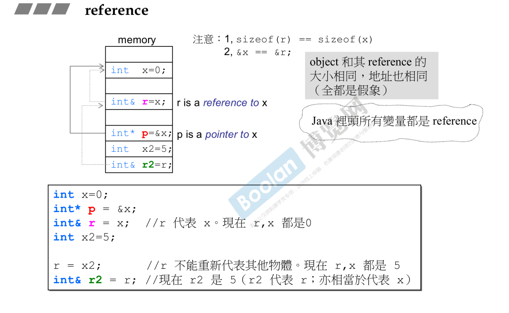
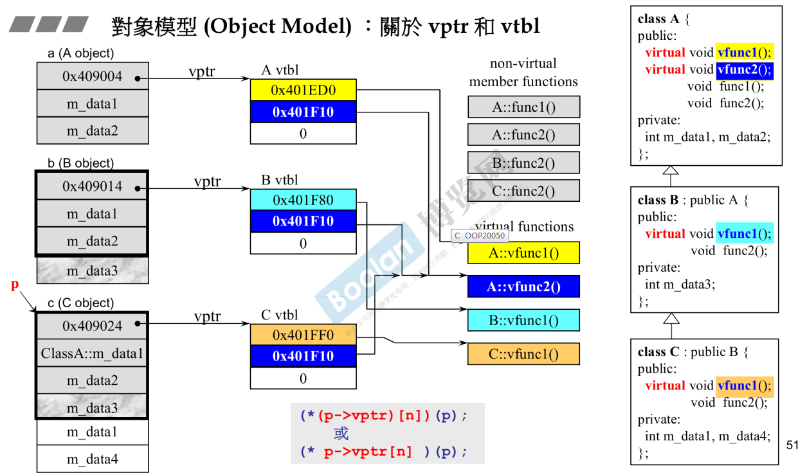
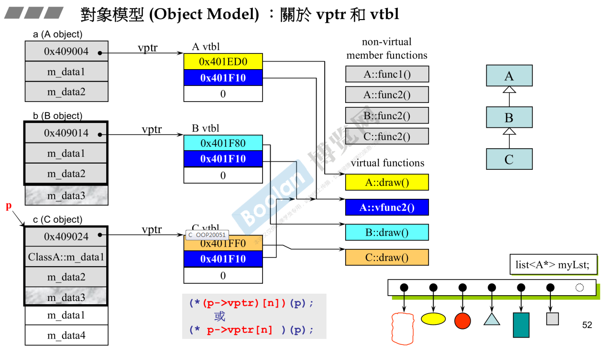

# C++程序设计(II)--勿在浮沙筑高台

* C++编程的两大主流：基于模版的泛型编程和基于面向对象编程。

* conversion function，转换函数

  ```c++
  // 分数转double
  class Fraction
  {
  public:
      Fraction(int num, int den=1): m_numerator(num), m_denominator(den){}
      // 转换函数，可以写好几个，比如double，string
      //1. 无返回类型， 2. 不会改变内容，一般要加const,
     	operator double() const
      {
          return (double) (m_numerator/m_denominator);
      }
  private:
      int m_numerator; // 分子
      int m_denominator; // 分母
  }
  
  Fraction f(3,5);
  // 1. 查看是否由operator+重载，重载不用看返回类型。
  // 2. 看看能够转换成double。
  double d = 4+f;
  ```

* non-explicit-one-argument ctor

  ```c++
  // 分数转double
  class Fraction
  {
  public:
      // explicit关键字，只能出现在构造函数之前(在模版中还会用到，不过很少)，指明这个函数只能是构造函数，默认是imexplicit，不能自动转换
      // non-explicit-one-argument ctor
      // 这个函数叫：two param，one argument。
      // one argument: 实参，争议值，就是num。这里是指一个实参就够了，两个也可以。
      // 构造函数可以作为转换函数。
      Fraction(int num, int den=1): m_numerator(num), m_denominator(den){}
  	// 返回类型是自己。
  	Fraction operator+(const Fraction& f)
      {
          return Fraction(...);
      }
  private:
      int m_numerator; // 分子
      int m_denominator; // 分母
  }
  
  Fraction f(3,5);
  // 1. 查看是否由operator+重载,找到，但是发现参数是Fraction&类型，那么就看看能否把4转换成Fraction
  // 2. 看看能够转换成double。
  Fraction d = f + 4;
  ```

* Pointer-like Classes 智能指针

  ```c++
  template<class T>
  class shared_ptr
  {
  public:
      T& operator*() const
      {return *px;}
      T* operator->() const
      {return px;}
      // 构造函数，接受普通指针。
      shared-ptr(T* p):px(p){}
  private:
      T* px; // px指向一个对象（可以是普通类型，可以是类）
      long* pn;
      .....
  };
  
  struct Foo
  {
      void method(void){...}
  };
  
  // 把Foo这个指针包装到智能指针中
  shared_ptr<Foo> sp(new Foo);
  // 利用原来的创建对象。
  // *没有传递性
  Foo f(*sp);
  // 通过'sp-> '获得 'px', 那'px'后面的'->'怎么来的呢？
  // 箭头符号的特殊行为：箭头符号的传递性，还会继续作用下去，或者叫做编译器魔法。
  sp->method();  // => px->method;
  
  ```
  
* 迭代器，也是一种智能指针，不过有++，--

  ```c++
  // 迭代器代表容器中的一个元素。
  // 指针++ 指针向前移动，--向后移动。
  template<class T>
  struct __list_node
  {
  	void* prev;
      void* next;
      T data;
  };
  template<class T, class Ref, class Ptr>
  struct __list_iterator
  {
      typedef __list_iterator<T, Ref, Ptr> self;
      typedef Ptr pointer;
      typedef Ref reference;
      typedef __list_node<T>* link_type;
      link_type node;
      bool operator==(const self& x) const {return node==x.node;}
      bool operator!=(const self& x) const {return node!=x.node;}
      reference operator*() const {return (*node).data;}
      pointer operator->() const {return &(operator*());}
      self& operator++() 
      {
          node = (link_type)((*node).next); 
          return *this;
      }
      self operator++(int) 
      {
          self tmp = *this;
          ++*this;
          return tmp;
      }
      self & operator--()
      {
          node = (link_type)((*node).prev);
          return *this;
      }
      self operator--(int)
      {
          self tmp = *this;
          --*this;
          return tmp;
      }
  };
  ```

* function-like Classes 仿函数

  ```C++
  // 函数的组成：1. 函数名，2.小括号，小括号又叫做function call operator;函数调用操作符
  // 如果一个东西能够接受小括号操作符，那么就把这个东西叫做函数，或者叫做像函数的东西
  // 这种对象叫做函数对象。
  template<class T>
  // identity 视为同一个东西
  struct identity: public unary_function<T, T>
  {
  	const T& operator() (const T& x) const {return x;}
  };
  
  // 
  template <class Pair>
  struct selectlst: public unary_function<Pair, typename Pair::first_type>
  {
  	const typename Pair::first_type& operator() (const Pair& x) const
      {
          return x.first;
      }
  };
  
  template <class Pair>
  struct select2nd: public unary_function<Pair, typename Pair:: second_type>
  {
      const typename Pair::second_type& operator() (const Pair& x) const
      {
          return x.second;
      }
  };
  
  // 下面的两个类是基类，大小是0
  template <class Arg, class Result>
  struct unary_function
  {
  	typedef Arg argument_type;
  	typedef Result result_type;
  };
  
  template <class Arg1, class Arg2， class Result>
  struct binary_function
  {
  	typedef Arg1 first_argument_type;
      typedef Arg1 second_argument_type;
  	typedef Result result_type;
  };
  
  template<class T1, class T2>
  struct pair
  {
      T1 first;
      T2 second;
      pair(): firsts(T1()), second(T2()) {}
      pair(const T1& a, const T2& b): first(a), second(b) {}
  }
  ```

* namespace 经验谈

  ```c++
  
  ```

* class template和function template 类模版和函数模版

  ```c++
  // 可以把一些类型抽出来让用户自己定义。
  // 函数模版使用时不需要说明类型，
  template <class T>
  inline
  const T& min(const T& a, const T& b)
  {
      return b < a ? b:a;
  }
  ```

* member template，成员模版

  ```c++
  // 最外层的是变化的，但是在最外层的确定之后，U1和U2又是可以变化的。
  // 一般构造函数会构造成这种类型。
  template<class T1, class T2>
  struct pair
  {
      typedef T1 first_type;
      typedef T2 second_type;
      
      T1 first;
      T2 second;
      
      pair():first(T1()), second(T2()) {}
      pair(const T1& a, const T2& b): first(a), second(b){}
      
      // 这个是类中的一个member，而这个又是一个template。
      template <class U1, class U2>
      pair(const pair<U1, U2>& p): first(p.first), second(p.second) {}
  };
  ```

* reference

  1. 地址就是一种指针的形式
  2. r代表x，不是指向x。编译器将r编译成指针，但意义上不是。
  3. r的大小是它代表的值的大小。
  4. reference一般不用来直接定义，而是用于参数类型和返回类型的描述

  

  ```c++
  int x = 0;
  int& r = x;
  cout << &x << endl; // 0065FDFC
  // 和上面是相同的。编译器魔法。
  cout << &r << endl; // 0065FDFC
  
  // 下面的两个函数的签名相同，不能同时存在。
  double imag(const double& im) {...}
  double imag(const double im) {...}
  // const是函数签名的一部分
  // 下面的两个函数可以同时存在。
  double imag(const double& im) const {...}
  double imag(const double im) {...}
  ```

* 对象模型（Object Model）虚指针(vptr)和虚表(vtbl)。

  ```c++
  // 如果一个类中有虚指针，那么这个类的对象中就会多一块指针大小的内存，这个内存就是虚指针。
  // 虚指针指向自己的虚拟方法表。
  // 下面用黑色粗线框起来的就是父类的的成分。
  // 函数调用的是调用权，父类有虚函数，则子类必有虚函数
  // ClassB中的func2和classA中的func2 毫无关系
  // vtbl中存放的都是函数指针。
  ```

  

  ```c++
  // 通过P来调用vfunc1; 现在假如vfunc1不是虚函数，会编译成call(pointer)。pointer时函数的地址。这种方式叫做静态绑定。
  // 现在vfunc1是虚函数。则会走上面的路线
  // 解析成c的形式，n的意思是第几个函数。
  (*(p->vptr)[n])(p);
  或
  (*p->vptr[n]) (p);
  ```

  
  
  ```c++
  // 容器中必须放大小相同的东西。
  // 获取每个对象指针，通过指针调用draw()方法。
  // 静态绑定的函数使用call来调用
  // 动态绑定（虚机制）的通过指针来调用。一般使用向上转型来保证调用的正确性。
  ```
  
* this指针

  ```c++
  // 通过对象来调用一个函数，那个对象的地址就是this。
  CDocument::OnFileOpen()
  {
      ....
      // 编译器转换成this->Serialize();
      // 1. 通过指针调用， 2. 向上转型，现在在父类的函数中，而this是子类对象，所以是向上转型3. 虚函数。就会动态绑定。
      // (*(this->vptr)[n])(this)。
      Serialize(); 
      ....
  }
  class CMyDoc: public CDocument
  {
      virtual Serialize(){}
  };
  
  main()
  {
      CMyDoc myDoc;
      myDoc.OnFileOpen();
      // 所有的成员函数都会有一个this指针。
      // 谁调用我，谁就是this。
      // this object 就是this指针指向的object。
      CDocument::OnFileOpen(&myDoc);
  }
  ```

* Const

  ```c++
  // 当成员函数的const 和non-const版本同时存在时，const Object只会调用const版本，non-const object只会调用non-const版本。
  // const可以作为重载的标志。
  ```

* 