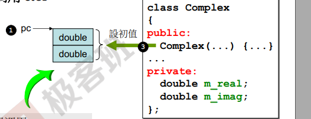

# C++面向对象程序设计--勿在浮沙筑高台

# 类

1. 类中数据只有1份，而函数有多份。

2. 如果类里面只有**一个指针**，那么这个类的大小就是**指针的大小**。

3. 防卫式声明

   ```c++
   #ifndef __COMPLEX__
   #define __COMPLEX__
   class complex
   {
   public:
       // 构造函数没有返回类型。
       complex (double r = 0, double i = 0)
           : re(r), im(i) //初值化，初始列，设初值 这种写法只能在构造函数中使用。
       {}
       // 为什么要用上面的写法，1. 变量有两个过程，一个是初值化，第二个是赋值。
       // 冒号后面的叫初值化，在大括号中的叫赋值。
       
       // 这个函数可以是成员函数，也可以是全局函数。
       complex& operator+=(const complex&);
       
       // 内联函数： 在类中实现的或者使用inline声明的。
       // 为什么要用const：如果返回值不改变re，im，那么就要加const。
       double real () const {return re;}
       double real(double r) {re = r;}
       double imag () const {return im;}
   private:
       double re, im;
       
       // 友元，是下面的函数，doassignmentplus, 可以直接获取re和im。
       friend complex& __doapl (complex*, const complex&);
   };
   
   inline double imag(const complex& x)
   {
       return x.imag();
   }
   
   // 1. 参数要不要传引用， 不是值类型就可以传引用
   // 2. 是不是const，如果不能改变就需要是const
   // 运算符会作用在左边的身上，作用在谁身上谁就是this。
   // 3. += 这个运算符是双目运算符，有一个左边和一个右边，那么左边那个运算符会作为一个隐藏的参数（this）传进来，
   // 可能是第一个参数，也可能是最后一个参数，不过我们写一个右边的参数就好了。
   // 4. 考虑返回值，如果这个返回值不是在这个函数中定义的，也就是说返回值不是局部的，那么就可以传引用
   // 5. 操作符重载一定是加在左边的运算符身上。
   inline complex&
   complex::operator +=( const complex& r)
   {
       return __doapl(this, r);
   }
   
   inline complex&
   __doapl(complex* ths, const complex& r)
   {
       ths->re += r.re;
       ths->im += r.im;
       return *ths;
   }
   
   // 不设计成成员函数，是因为有可能是复数加实数，复数加double
   // 因为返回值是local的，所以不能传引用
   inline complex
   operator + (const complex& x, const complex& y)
   {
       // 这里创建了一个临时对象。
       return complex(real(x) + real(y), imag(x) + imag(y));
   }
   
   inline complex
   operator + (const complex& x, double y)
   {
       return complex(real(x) + y, imag(x));
   }
   
   inline complex
   operator + (double x, const complex& y)
   {
       return complex(x + real(y), imag(y));
   }
   
   // << 这个操作符重载要写成费成员函数，因为操作符重载会加载到左边的运算符身上
   // 那么要写成 
   complex c1(9, 8);
   cout << c1;
   c1 << cout; // 这样很奇怪。
   cout << c1; // 执行完成后应该返回一个ostream类型的对象。
   
   // os为什么不是const，因为它的状态一直在改变。
   // 因为os不是局部的，所以可以返回引用。
   ostream&
   operator << (ostream& os, const complex& x)
   {
       return os << '(' << real(x) << ',' << imag(x) << ')';
   }
   #endif
   
   // 如何写模版类
   template<typename T>
   class complex
   {
   public:
   private:
       T re, im;
   };
   // 使用方法
   {
       complex<double> c1(2.5, 1.5);
       complex<int> c2(2, 6);
   }
   ```

4. 对象创建的时候，构造函数会自动调用

   ```c++
   {
       // 不能主动调用构造函数
       complex c1(2, 1);
       complex c2; // 如果声明了构造函数，那么调用有默认值的构造函数
       complex* p = new complex(4);
   }
   ```

5. 没有指针成员的类多半不用写析构函数。

6. 重载的函数虽然看上去名称相同，实际上名称是不同的

   ```c++
   double real () const {return re;}
   void read(double r) {re = r};
   // 这两个函数会被编译器编译成，在一个类中不会有相同名称的函数。
   ?real@Complex@@QBENXZ
   ?real@Complex@@QAENABN@Z
   ```

7. 值类型传值和传引用的效率是一样的。

8. 带有指针的类，string

   ```c++
   // 用例
   int main()
   {
       String s1();
       String s2("hello");
       
       String s3(s1); // 使用s1创建s3, 拷贝构造， 拷贝s1的内容
       cout << s3 << endl;
       s3 = s2;  // 拷贝复制
       // 如果没有写拷贝构造和拷贝复制，那么会有默认的，但是默认的不能满足的话，那么就要写自己的。
       cout << s3 << endl;
   }
   #ifndef __MYSTRING__
   #define __MYSTRING__
   class String
   {
   public:
       // 如果类有指针成员那么就必须有拷贝构造和拷贝复制。
       // 拷贝构造：浅拷贝和深拷贝，浅拷贝就是默认的拷贝，深拷贝是自己写的拷贝。
       // 下面的函数不能加const, 因为自己是目的端，要把来源端的东西写到目的端，那么目的端一定会变，也就是自己一定会变，所哟不能加const。
       String(const char* cstr = 0); // String(const char* cstr = 0) const;
       String(const String& str);
       String& operator=(const String& str);
       ~String();
       char* get_c_str() const (return m_data);
   private:
       char* m_data;
   };
   
   inline
   String::String(const char* cstr = 0)
   {
       if(cstr)
       {
           m_data = new char[strlen(cstr) + 1];
           strcpy(m_data, cstr);
       }
       else
       {
           m_data = new char[1];
           *m_data = '\0'; // 空字符串
       }
   }
   
   // 拷贝构造
   inline
   String::String(const String& str)
   {
       // 深拷贝。
       m_data = new char[strlen(str.m_data) + 1];
       strcpy(m_data, str.m_data);
   }
   
   // 拷贝赋值。
   // 过程：1. 把原来的杀掉， 2. 重新分配和现在一样大的内存，3，拷贝过来
   inline 
   String& String::operator=(const String& str)
   {
       // 自我检测赋值
       if(this == &str)
           return *this;
       // 1. 杀掉原来的
       delete[] m_data;
       // 2. 申请一块和现在一样大小的内润
       m_data = new char[strlen(str.m_data) + 1];
       // 3. 把自己赋值过去
       strcpy(m_data, str.m_data);
       // 返回类型是引用类型，传出去的值不需要知道接收端使用什么方式接受，所以返回类型可以是String或者String&。
       // 返回类型是值或者是引用是根据返回的东西是局部的还是全局的。
   	return *this;
   }
   
   inline
   String::~String()
   {
       delete[] m_data;
   }
   #endif
   
   {
       String s1();
       String s2("hello");
       
       String *p = new String("hello");
       delete p;
   }
   ```

9. const 修饰成员函数

   ```c++
   // 下面一种情况容易被忽视, 如果print没有被const修饰，那么无法编译通过
   const String str("hello world");
   str.print();
   
   // 看一下下面的例子
   #include<iostream>
   
   using namespace std;
   
   class A
   {
   private:
       int data;
   public:
       A(int num):data(num){}
       ~A(){};
       int& get_data()
       {
           return data;
       }
   };
   
   int main()
   {
       const A a(1);
       a.get_data();
       return 0;
   }
   
   // 编译出错
   error: 'this' argument to member function 'get_data' has type 'const A', but function is not marked const。
   // 其实任何成员函数的参数都含有this指针的，只不过c++规定全部不写这个参数，
   // 在例子中a是一个const对象，它调用了get_data方法，所以函数签名应该是：
   get_data(a){}
   // 而a是一个const对象，我们默认的this指针不是const类型的，那么参数类型不匹配，那么编译无法通过。
   ```

10. 栈和堆

    Stack是存在于某个作用域（scope）的一块内存空间（memroy space）。例如当你调用函数，函数本身即形成一个stack用来方式它所接收的参数，以及返回地址，以及局部对象(local object)。

    在函数本体(function body)内声明的任何变量，其所使用的内存块都取自上述的stack。

    Heap，或system heap，是指由操作系统提供的一块（全局的）global内存空间，程序可移动分配(dynamic allocated)从某中获得若干个区块(blocks)。

    ```c++
    // Stack object
    class Complex{......};
    ...
    {// 可以把这个大括号看成一个函数
        // c1所占用的空间来自于stack。
        // 当离开作用域时，c1会自动释放。
        // 析构函数会自动调用。因此也叫做aotu object。
        Complex c1(1,2);  
        // Complex(3)是一个临时对象，其所占用的空间乃是new自heap动态分配而得，并有p指向。
        Complex *p = new Complex(3);
    }
    
    {
        // 静态对象。其生命在作用域结束时仍然存在，只有在程序结束时释放。
        static Complex c2(1,2);
    }
    
    // 全局对象global object, 其生命在整个程序结束后才结束，也可以视为一种static object，其作用于是整个程序
    // 存在和消失就是构造函数和析构函数什么时候调用。
    complex c3(1,2);
    int main()
    {
        
    }
    ```

    ```c++
    // heap objects
    class Complex{.....};
    ......
    {
        //p所指的便是heap object，其生命在它被deleted后结束。
        Complex* p = new Complex;
        ...
        delete p;
    }
    
    {
        // 出现内存泄漏，因为当作用域结束时，p所指的heap object任然存在，但是指针p的生命
        // 却结束了，作用域之外再也看不到p，也就没有机会delete p。
        Complex *p = new Complex;
    }
    
    // new：先分配memory，在调用ctor
    complex *pc;
    // 1. void* mem = operator new(sizeof(Complex)); ,new 是调用malloc方法。
    // 2. pc = static_cast<Complex*>(mem);
    // 3. pc->Complex::Complex(1,2); ,调用构造函数
    // 谁来调用，谁就是this，complex::Complex(pc, 1, 2);
                                            this
    // pc就是申请的内存的首地址。
    ```

    

    ```c++
    // delete
    String* ps = new String("hello");
    ....
    delete ps;
    
    // 1. String::~String(ps); ，析构函数
    // 2. operator delete(ps); ，释放内存，调用free。
    ```

11. 动态分配所得的内存块(memory block) in VC

    

    1. 第一列是调试模式
    2. 一行是4个字节。
    3. 这里是用new来获得一个复数，32位机器。
    4. 每一行是一个字节。
    5. 红色的是cookei（小甜饼干），用来标记整块的大小。
    6. pad是填补物。
    7. 8+（32+4+4*2）= 52
    8. 区块的大小是64个字节大小，16进制是40，然后利用最后一位来标识是给出去还是要收回来。**1是获得，0是给出**（对于程序而言是获得，对于操作系统是给出）。所以是**41**。
    9. 为什么可以使用最后一位，因为分配的内存是16个字节的倍数，所以最后一位一定是0，所以可以用来标记。
    10. 如果要还给操作系统了，那么就会标记为**40**。
    11. 第二列是非调试模式，就没有灰色区域了。

12. **分配的内存一定是16的倍数**。52不是16的倍数，所以就分配64个。

13. 如果分配的是数组，那么内存结构是怎么样呢？

    ```c++
    // array new 要搭配 array delete
    // 3指的是数组的个数。VC下面是这样的。
    // 如果不使用delete释放内存呢？
    String* p = new String[3];
    ....
    delete[] p; // 唤起3次dtor
    delete p; // 唤起了1次dtor
    ```

    

14. Static

    | complex                 |      |
    | ----------------------- | ---- |
    | data members            |      |
    | static data members     |      |
    | member functions        |      |
    | static member functions |      |

    

    非静态的由对象来调用，谁来调用我，谁就是this pointer。因为c1调用，所以&c1就是this指针。

    函数代码只有一份，而对象有很多份，那函数应该处理那个对象呢？靠的就是this pointer。

    加了static的数据，这个就和对象脱离了，它不属于对象。静态的数据一般要设初值。

    static的函数和成员函数相比，它没有this pointer。

    ```c++
    class Account
    {
    public:
        static double m_rate;
        // 静态函数没有this pointer，所以只能处理静态数据。
        static void set_rate(const double& x);
    };
    
    // m_rate的定义(获得内存)，不是声明。
    // 静态变量的初始化。
    double Account::m_rate = 8.0;
    
    int main()
    {
        // 通过类名称直接调用。
        // 这个时候对象还没有。
        Account::set_rate(5.0);
        Account a;
        // 通过对象来调用。
        a.set_rate(7.0);
    }
    
    // 单例模式
    class A
    {
    public:
        static A& getInstance(){return a;};
        setup {....}
    private
        A();
        A(const A& rhs);
        // a本身已经存在了。
        // 不过这样不太好，外界还没调用a就存在了
        static A a;
        .....
    };
    
    A::getInstance().setup();
    
    // 单例模式更好的解法
    class 
    {
    public:
        static A& getInstance();
        setup() {...};
    private:
        A();
        A(const A& rhs);
    };
    
    A& A::getInstance()
    {
        static A a;
        return a;
    }
    
    A::getInstance().setup(); 
    ```

15. cout 的补充

    ```c++
    cout 是很多重载
    ```

16. class template, 类模版； function template，函数模版

    ```c++
    template<typename T>
    class complex
    {
    public;
        complex(T r = 0, T i = 0): re(r), im(i) {}
        complex& operator += (const complex&);
        T real () const {return re;}
        T image() const {return im;}
    private:
        T re, im;
    }
    // 模版会造成代码的膨胀。
    
    // 函数模版，编译器会对function template 进行实参推倒（argument deduction）
    template <class T>
    inline
    const T& min(const T& a, const T& b)
    {
        // 这里一定要对'<'进行操作符重载。
        return b < a ? b : a;
    }
    ```

17. name space

    ```c++
    namespace std
    {
        ...
    }
    
    // 不同文件中的同名空间会合并。
    // 使用命名空间中的东西
    using std::cout;
    ```

18. 复合

    ```c++
    // Compositon(复合):声明一起出现
    template<class T>
    class queue
    {
    protected:
        deque<T> c;  // 使用c来实现功能
    public:
        bool empty() const {return c.empty();} // 适配器模式。
        size_type size() const {return c.size();}
    };
    // Compositon 下的构造和析构
    // 构造和析构顺序：构造由内而外，析构由外而内。
    Container::Container():Component(){...}
    // Container::~Container(){~Component()}
    ```

19. 委托（Delegation），Compositon by reference.

    ```c++
    // 生命不同时。（Handle/Body）
    // 引用计数，写时复制。
    class StringRep; // 这个类实现了String类的所有功能
    class String
    {
    public:
        String();
        String(const char* s);
        String(const String& s);
        String &operator=(const String& s);
        ~String();
    private:
        StringRep* rep; // pimpl: 一个指针，这个指针实现了类的所有功能。
    }
    ```

    

20. 继承（Inheritance），Is-a

    ```c++
    struct _List_node_base
    {
    	_List_node_base* _M_next;
        _List_node_base* _M_prev;
    };
    
    template<typename _Tp>
    struct _List_node: public _List_node_base  // 共有继承。
    {
    	_Tp _M_data;  
    };
    
    // 构造顺序: 先父类，在子类。
    // 析构顺序：先子类，在父类。析构函数必须是virtual。
    // 数据会被继承下来，函数继承的是调用权。
    // 纯虚函数 pure virtual funcion
    // 纯虚函数子类必须实现。
    // 所有函数是纯虚函数的类叫纯虚类。
    class Shape
    {
    public:
        virtual void draw() const = 0; // 纯虚函数
        virtual void error(const std::String& msg);
        int objectID() const;
    };
    
    class Rectangle:public Shape{...}
    class Ellipse:public Shape{...}
    ```

    

21. Inheritance + Composition 关系下的构造和析构

    ```c++
    // 第二个的构造顺序是先Component->Base->Derived。
    ```

    

    

22. Delegation+Inheritance

    ```c++
    // 观察者模式
    class Subject
    {
    private:
    	int m_value;
        vector<Observer*> m_views;
    public:
        void attach(Observer* obs)  // 注册，你要来观察我，你来我这注册
        {
            m_views.push_back(obs);
        }
        void set_val(int value)  
        {
            m_value = value;
            notify();
        }
        void notify()  // 
        {
            for(int i=0; i<m_views.size(); ++i)
                m_views[i]->update(this, m_value);
        }
    };
    
    class Observer
    {
    public:
        virtual void update(Subject* sub, int value) = 0;
    };
    ```

23. Composite

    ```c++
    // 类似于文件系统，Primitive类似于流，Composite类似与存储。
    ```

    

24. Prototype(原型模式)

    ```c++
    
    ```

    

25. 

