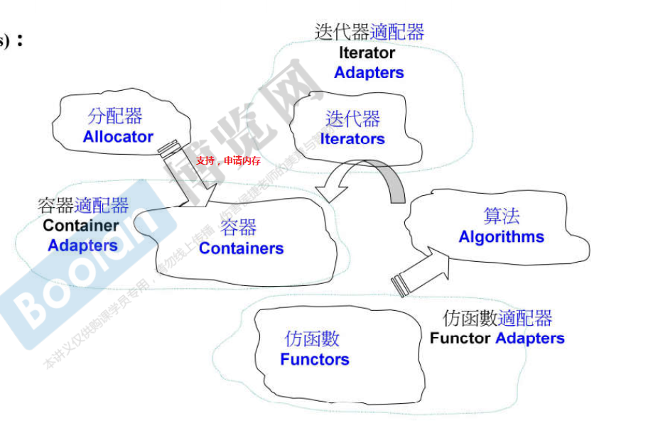
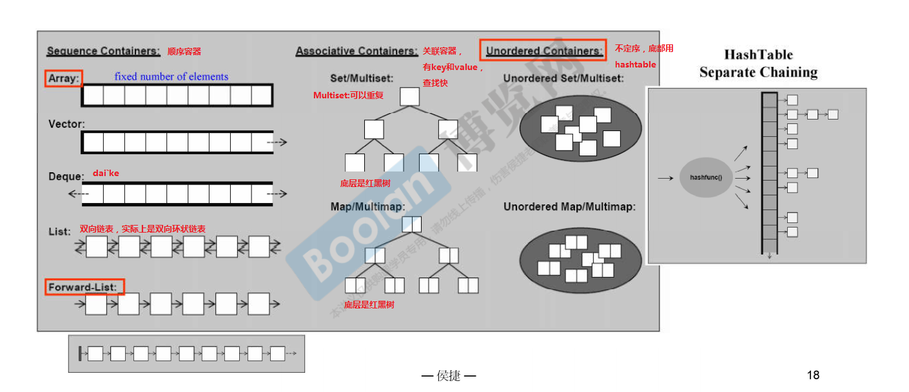
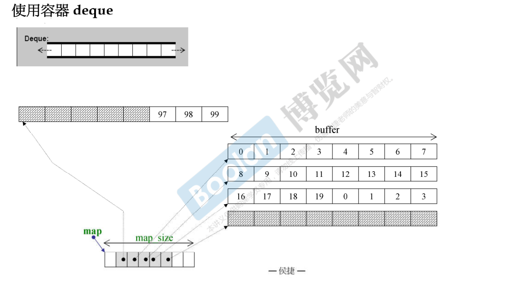
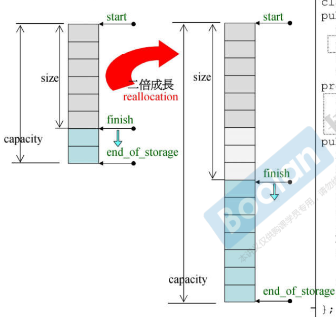

# C++ STL

STL: Standard Template Library; 标准模版库

C++ Standard Library; C++ 标准库

C++ 标准库包括STL。

STL包括六大部件：容器(Containers)，分配器(Allocators)，算法(Algorithms)，迭代器(Iterators)，适配器(Adapters)，仿函数(Functors)



```c++
#include <vector>
#include <algorithm>
#include <functional>
#include <iostream>

using namespace std;

int main()
{
    int ia[6] = {27, 210, 12, 47, 109, 83};
    vector<int, allocator<int>> vi(ia, ia+6);
                //分配器，可以不写，会有默认的一个分配器, 分配器也是一个模版，需要告诉分配是什么东西
    cout << count_if(vi.begin(), vi,end(), not1(bind2nd(less<int>(), 40)));
            //algorithm        // iterator // 这句话叫做大于等于40
    return 0;
}

// count_if: 算法，符合条件的元素的个数。
// vi.begin(); :迭代器，泛化的指针，类似于指针。
// less:仿函数
// bind2nd: adapter.
```

* 前闭后开区间。

  ```c++
  begin(); // 第一个元素
  end(); // 最后一个元素的后一个位置。
  ```



## 容器测试

### vectorcc

```c++
// vector可以往后扩展，vector 是两倍大小增长的，1,2,4,8，...
// 成长的过程：1. 重新申请两倍大小的空间，2. 把现在已有的数据重新拷贝到新的内存中。
// 模版函数是全局的模版的函数
// 排序
vector<string> vt;
sort(vt.begin(), vt.end());
```

### list

```c++
// list 双向链表
list<string> c;
// list有自己的sort, 
// 有的容器有自己的sort算法，同时全局也有sort算法，有自己的就调用自己的，自己的快。
c.sort();
c.push_back(string(buf));
```

### forward_list

```c++
// 单项列表
forward_list<string> c;
c.push_front(string(buf));
```

### slist

```c++
// single list, 单链表
// 单项列表，不过是非标准库的，和 forward_list 相同。
// 放在<ext\slist>下，extension：扩充
```

### deque



```c++
// 双向开口队列， 分段连续
// 让使用者感觉是连续的
// 如果所有的buffer满了，在push_back或者push_front, 会重新申请buffer，然后用指针指向该buffer。
```

### stack和queue

```c++
// 本身使用deque
// 所以有人不把stack和queue叫做容器，二是叫做adapter(适配器)。
// 这两个容器不提供iterater的操作。
// 没有find操作。
```

### multiset

```c++
// 允许元素重复
// 底层结构是红黑树
// 查找非常块，key就是value，value就是key
multiset<string> c;
// 插入数据，插入时就已经排好序了。
c.insert();
::find(c.begin(), c.end(), target);
c.find(target);
// 大小是size
c.size();
```

### multimap

```c++
// multimap 
multimap<long, string> c;
c.insert(pair<long, string>(i, buf));
// multimap不可以使用[]做insert。
c.find(target);
auto pItem = c.find(target);
// 输出第二个元素
cout << (*pItem).second << endl;
```

### unordered_multiset

```c++
// 底层是hash table
unordered_multiset<string> c;
// 篮子的个数。有的篮子有元素，有的篮子没有元素，有的篮子有多个元素，有的只有一个元素。
// 篮子的个数一定比元素多（内部的设计）
// 经验：如果元素的个数大于等于篮子的个数，篮子的个数就要扩充，大约是元素的两倍大小。
c.bucket_count(); 
// load_factor, 在中因子
c.load_factor();
// find
:: find(c.begin(), c.end(), target);
c.find(target);
```

### unordered_multimap

```c++
// unordered_multimap
// 用法和multimap基本相同
```

### set

```c++

```

### map

```c++
// 可以使用[]， 而multimap不可以
map<long, string> c;
// 可以直接这样写。
c[i] = string(buf);
```

### unordered_set

```c++

```

### unordered_map

```c++

```

## 使用分配器

allocator

```c++
// 最好不要直接使用分配器
// 
```

## OOP（面向对象）和GP（面向过程）

* 所有的algorithms，其内最终涉及元素本身的操作，无非就是比大小

* OOP

```c++
template<class T, class Alloc = alloc>
class list
{
    void sort();
};

```

* GP

```c++
// vector 和 deque都没有提供排序函数
// 算法和数据是分开的，使用迭代器两者相互关联
template<class T, Class Alloc = alloc>
class vector
{
    ...
};
template<class T, class Alloc = alloc, size_t BufSiz = 0>
class deque
{
    ...
}

// Algorithms
// _RandomAccessIterator 随机访问迭代器，随机访问迭代器好像是要连续的，所以链表不能使用这种，而是有自己的sort。
template<typename _RandomAccessIterator>
inline void
sort(_RandomAccessIterator __first, 
     _RandomAccessIterator __last)
{
    ...
}

template<typename _RandomAccessIterator,
		typename _Compare>
inline void
sort(_RandomAccessIterator __first, 
     _RandomAccessIterator __last)
{
    ...
}

// 例子，比大小
template<class T>
inline const T& min(const T& a, const T& b)
{
    // 这里使用 T 类型的 < 运算符
    return b < a?b:a;
}
```

## 分配器

* 一般不建议直接使用，它是给容器用的。

```c++
operator new() 和 malloc();

// operator new() 会调用 malloc()
// malloc() 会给的比自己要的要多，会有一些额外的开销, 也就是会给一些其他的内存
// VC6 STL 对allocator的使用
template<class _Ty, class _A = allcoator<_Ty>>
class vector
{
...  
};

// VC6下allocator实现如下
// VC6下的allocator知识以::operator new 和::operator delete完成allocate()和deallocatr(), 没有任何特殊设计
template<class _Ty>
class allcocator
{
public:
    typedef _SIZT size_type;
    typedef _PDFT deffierence_type;
    typedef _Ty _FARQ *pointer;
    typedef _Ty value_type;
    pointer allocate(size_type _N, const void *)
    {
        return (_Allocate((difference_type) _n, (pointer)0));
    }
    void deallocate(void _FARQ *_P, size_type)
    {operator delete(_P)}
};

template<class _Ty> inline
_Ty _FARQ *_Allocate(_PDFT _N, _Ty _FARQ *)
{
    if(_N < 0) _N = 0;
    return ((_Ty _FARQ *)operator new((_SIZT)_N * sizeof(_TY)));
}

// 容器的元素大小是一样的。
// 上面的分配器效率很慢
```

### 更好的分配器 alloc


```c++
// alloc 维护一个链表，数据会被凑成8的倍数，第0号链表维护字节大小为8个字节大小的链表，第7号链表会维护数据为56个字节大小的内容。
// 当一开始来数据的时候，会先使用malloc分配一块很大的内存，然后对内存进行切割，成为单项链表（或者说是数组），然后给出一块保存数据
```

## 深入探索list

* list 是一个双向链表

```c++
// C2.9
// 节点类
template <class T>
struct __list_node
{
    typedef void* void_pointer;
    // 实现的时候需要强制转型
    void_pointer prev;
    void_pointer next;
    T data;
};
// 链表类
template<class T, class Alloc = alloc>
class list
{
protected:
    typedef __list_node<T> list_node;
public:
    // 节点类型
    typedef list_node* link_type;
    typedef __list_iterator<T, T&, T*> iterator;
protected:
    // 链表类的内容，
    link_type node;
};

// 因为链表不是连续的内存，所以迭代器不是指针，如果时指针的话++，--操作没有办法进行
// 这里的iterator要足够聪明能够知道++的时候指向下一个节点
// 其实所有的容器除了array和vector都是class，只有这样才能够聪明
template<class T, class Ref, class Ptr>
struct __list_iterator
{
    typedef T value_type;
    typedef Ptr pointer;
	typedef Ref referenct;    
};

// iterator因为要模拟指针的操作，所以里面有大量的运算符重载
// iterator 中一般包括两大部分，第一部分就是typedef，其中有5个是必须的；第二部分是操作符重载
// list 的迭代器
template <class T>
struct __list_node
{
    typedef void* void_pointer;
    // 实现的时候需要强制转型
    void_pointer prev;
    void_pointer next;
    T data;
};

template<class T, class Ref, class Ptr>
struct __list_iterator
{
    typedef __list_iterator<T, Ref, Ptr> self;
    typedef bidirectional_iterator_tag iterator_category;
    typedef T value_type;
    typedef Ptr pointer;
    typedef Ref reference;
    typedef __list_node<T> link_type;
    typedef ptrdiff_t difference_type;
    
    link_type node;
    
    reference operator*() const {return (*node).data;}
    pointer operator->() const {return &(operator*());}
    // 1. 找到next指针， 2. 返回next指向的内容。
    self& operator++()  // 前++
    {
        node = (link_type)((*node).next); 
        return *this;
    }
    self operator++(int) // 后++
    {
        // 这里*this不会被解释为 operator*, 而是会先运算'='这个符号，直接解释为作为operator=()的参数，进行拷贝构造
        self tmp = *this; 
        // 这里*this也不会运算，而是作为operato++()的参数。
        ++*this; 
        // 最后，return by value， 唤起拷贝构造
        return tmp;
    }
    ...
};

// 因为iterator是前闭后开区间，所以list最后的一个节点是空节点。

// 上面前置++返回引用，而后置++返回的是值。是因为c++规定的操作
int i(6);
++++i; // 等价于++(++i);
i++++; // 不等价于(i++)++, 这句话本身就不正确，

// iterator 用法
// list<Foo>::iterator：这是一个声明。
list<Foo>::iterator ite;
```

## Iterator需要遵循的原则

* traits：特征，特性，它是一种萃取器，也是一个中间层，来萃取出自己想要的特征。
* traits有iterator traits，type traits caratory traits pointer traits。

```c++
// iterator 是算法和容器的桥梁。
```

## vector 深度探索



* 动态增长的array
* 实际上没有东西可以在内存中原地扩充，一般需要重新申请一块比较大的内存，然后把原来的东西复制过去。
* vector 是两倍增长的。
* vector 重点代码

```c++
template< class T, class Alloc = alloc>
class vector
{
public:
    typedef T value_type;
    typedef value_type* iterator; //T*
    typedef value_type& reference;
    typedef size_t size_type;
protected:
    // 这三个指针是vector的大小，一共12个字节
    iteraotr start; // 指向第一个元素的地址
    iterator finish; // 指向最后一个元素的下一个元素的地址
    iterator end_of_storage; // 容器可容纳最后一个元素的下一个地址。
public:
    iterator begin() {return start;}
    iterator end() {return finish;}
    size_type size() const {return size_type(end() - begin());}
    size_type capacity() const {return size_type(end_of_storage - begin());}
    bool empty() const {return begin() == end();}
    // 序列式容器都要重载[] 这个方法
    reference operator[] (size_type) {return *begin() + n;}
    reference front() {return *begin();}
    reference back() {return *(end() - 1);}
    // push_back
    void push_back(const T& x)
    {
        if (finish != end_of_storage) // 有空间可用
        {
            construct(finish,x);  // 全局函数
            ++finish;  // 调整水平高度
        }
        else  // 没有空间可用
            insert_aux(end(), x);
    }   
};
template<class T, class Alloc>
void vector<T, Alloc>::insert_aux(iterator position, const T& x)
{
    if(finish != end_of_storage) // 如果有空间可用
    {
        // 在空间开始处添加一个元素，并以vector最后一个元素的值为初始值
        construct(finish, *(finish - 1));
        ++finish; // 调整水品
        T x_copy = x;
        copy_backward(position, finish-2, finish-1);
        *position = x_copy;
    }
    else // 没有空间可用
    {
        const size_type old_size = size(); // 记录原来的大小
        const size_type len = old_size != 0 ? 2*old_size:1;
        // 上面的分配原则: 如果大小为0，则分配1个元素大小的空间
        // 如果原大小不为0， 则分配两倍大小
        // 前半段用来放置原数据，后半段来放置新数据
        iterator new_start = data_allocator::allocate(len);
        iterator new_finish = new_start;
        try
        {
            // 将原来vector的内容拷贝到新的vector中
            new_finish = uninitialized_copy(start, position, new_start);
            construct(new_finish, x); // 为新的元素设初值
            ++new_finish; // 调整水位
            // 拷贝安插点后的原内容（因为它也可能被insert(p,x)呼叫）
            new_finish = uninitialized_copy(position, finish, new_finish);
        }
        catch(...)
        {
            // "commit or rollback" semantics
            destroy(new_start, new_finish);
            data_allocator::deallocate(new_start, len);
            throw;
        }
    }
    // 释放原来的vector
    destroy(begin(), end());
    deallocate();
    // 调整迭代器，指向新的vector。
    start = new_start;
    finish = new_finish;
    end_of_storage = new_start + len;
}
```

## vector iterator

* 由于vector是连续空间，那么直接用指针就可以

```c++

```


